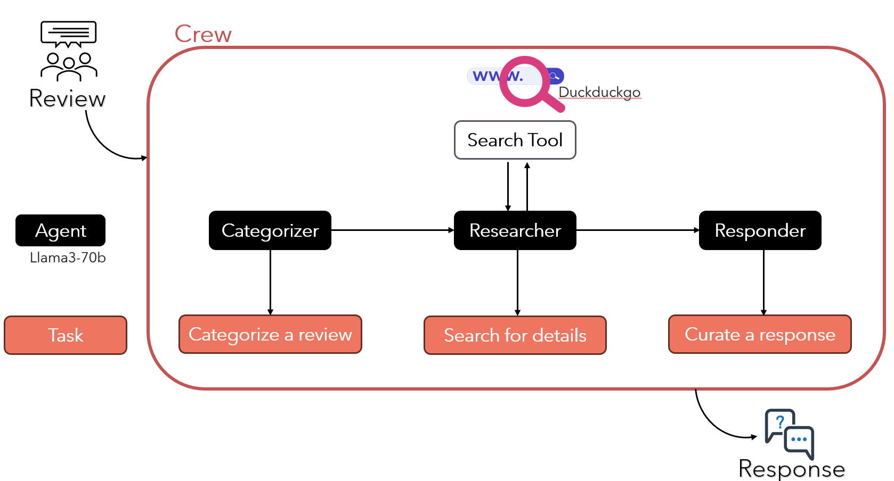
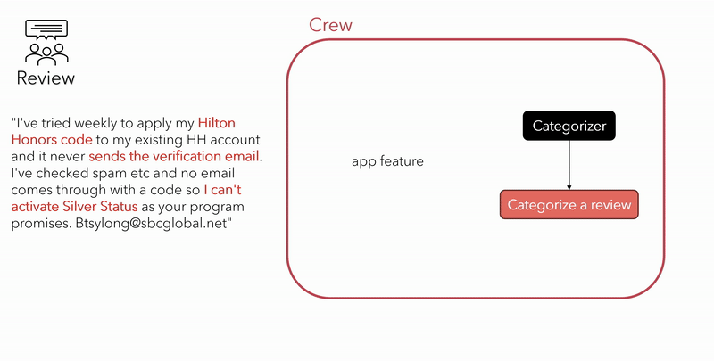
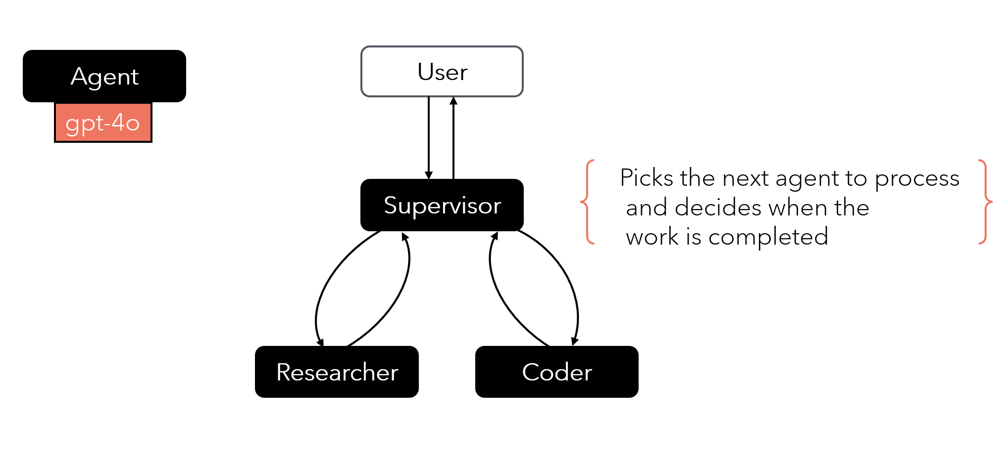
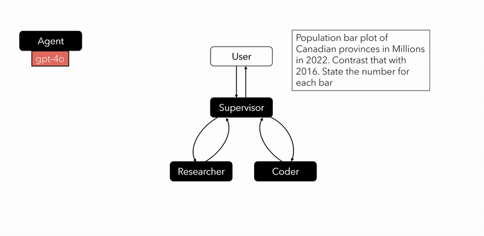

# AI Avengers

## Response Generation Agent
This notebook contains a multi-agent network designed to facilitate automated customer review responses. The system is built using Crew AI, with each crew specializing in a specific role to handle different aspects of the review response process. The network includes three key crews: **Categorizer**, **Researcher**, and **Responder**.

## Overview

The multi-agent network is designed to efficiently analyze and respond to customer reviews by delegating tasks among specialized agents. Each crew has a distinct responsibility:

1. **Categorizer**: Analyzes incoming reviews to determine their type and urgency. The Categorizer assigns each review to an appropriate category, ensuring that the right response strategy is used.

2. **Researcher**: Gathers supplementary information needed to respond accurately. Using an integrated search tool, the Researcher compiles relevant data to address specific customer concerns, product details, or common issues.

3. **Responder**: Crafts the final response to the customer. The Responder uses information from both the Categorizer and Researcher to ensure the response is comprehensive, relevant, and aligned with the company’s tone and policies.

## Architecture

This network is built on Crew AI’s multi-agent framework. Each agent within a crew operates autonomously but is designed to collaborate seamlessly with other agents to streamline the review response workflow.

    

### Workflow

1. **Input**: A new customer review is submitted to the network.
2. **Categorization**: The Categorizer analyzes the review’s content and assigns it to a category (e.g., app feature, deals and offers, network coverage).
3. **Research**: The Researcher conducts background research based on the categorized topic, gathering any necessary context, data, or reference information.
4. **Response Creation**: The Responder compiles a response, integrating insights from both the Categorizer and Researcher to ensure accuracy and completeness.
5. **Output**: The final, curated response is outputted, ready to be shared with the customer.

    

## Data Analyst Agent

This notebook contains the codebase for a multi-agent network designed for data analysis tasks. The system is built using **LangGraph**, with each agent specializing in a specific role to efficiently handle user inquiries. The network comprises three key agents: **Supervisor**, **Researcher**, and **Coder**.

## Overview

The Data Analyst Agent network is designed to facilitate a seamless flow of information from user queries to data visualization. Each agent has a distinct responsibility:

1. **Supervisor**: Acts as the main coordinator, receiving inputs from users. The Supervisor breaks down user questions into manageable components and directs them to the Researcher.

2. **Researcher**: Utilizes an integrated search tool to find relevant information. The Researcher processes the questions received from the Supervisor and returns answers or data back to the Supervisor.

3. **Coder**: Leverages the information provided by the Researcher using a Python REPL tool. The Coder creates visualizations and plots based on the data analyzed. 

## Architecture

This network is built on the LangGraph framework. Each agent operates independently but communicates efficiently to ensure user questions are addressed promptly and accurately.

    

### Workflow

1. **Input**: A user submits a question or request for analysis to the Supervisor.
2. **Question Breakdown**: The Supervisor analyzes the input question, breaking it down into specific queries as needed, and forwards them to the Researcher.
3. **Information Retrieval**: The Researcher searches for relevant answers using the search tool, gathering necessary data.
4. **Validation**: The Supervisor assesses whether the Researcher has provided all the required information. If not, it loops back to the Researcher for further clarification or additional data.
5. **Output Preparation**: Once the Supervisor is satisfied with the information, it sends the data to the Coder.
6. **Data Visualization**: The Coder uses the Python REPL tool to execute code and generate plots or other visualizations based on the research findings.

    

